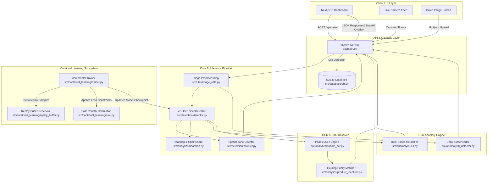

# Retail Shelf Intelligence v2

An enterprise-grade, AI-powered computer vision and analytics platform for real-time retail shelf monitoring, automated inventory audit, multi-stage anomaly detection, OCR product label identification, and continual learning without catastrophic forgetting.

---

## Table of Contents
1. [Project Title & Overview](#1-project-title--overview)
2. [Key Features & Capabilities](#2-key-features--capabilities)
3. [System Architecture & Data Flow](#3-system-architecture--data-flow)
4. [Repository & Directory Structure](#4-repository--directory-structure)
5. [Technology Stack & Dependencies](#5-technology-stack--dependencies)
6. [Environment Setup & Installation](#6-environment-setup--installation)
7. [Dataset Preparation (SKU-110K)](#7-dataset-preparation-sku-110k)
8. [Model Training & Fine-Tuning](#8-model-training--fine-tuning)
9. [Continual Learning Pipeline](#9-continual-learning-pipeline)
10. [Active Learning & Sample Selection](#10-active-learning--sample-selection)
11. [Anomaly Detection Pipeline](#11-anomaly-detection-pipeline)
12. [OCR & Product Identification Engine](#12-ocr--product-identification-engine)
13. [REST API Documentation](#13-rest-api-documentation)
14. [Frontend Dashboard Guide](#14-frontend-dashboard-guide)
15. [Evaluation, Verification & Benchmarking](#15-evaluation-verification--benchmarking)
16. [Configuration Reference](#16-configuration-reference)
17. [Troubleshooting & Known Caveats](#17-troubleshooting--known-caveats)

---

## 1. Project Title & Overview

**Retail Shelf Intelligence v2** addresses key operational challenges in modern retail management: out-of-stock conditions, planogram non-compliance, missing price tags, and inefficient manual inventory counts.

The platform provides an end-to-end computer vision pipeline that processes shelf imagery from handheld devices or fixed cameras. Powered by a fine-tuned **YOLOv8** object detector, a dual-layer **rule-based + PyTorch Autoencoder anomaly engine**, GPU-accelerated **PaddleOCR**, and an **Experience Replay + Elastic Weight Consolidation (EWC)** continual learning system, the platform turns raw shelf images into actionable retail analytics.

### Key Highlights:
* **Dense Object Detection:** Optimized for high-density retail environments using the SKU-110K benchmark.
* **Dual Anomaly Detection:** Rule-based heuristics for spatial stock gaps and an un-supervised Convolutional Autoencoder for visual shelf damage / misplaced products.
* **GPU-Optimized OCR:** Extracts text labels and prices using PaddleOCR (DB + SVTR_LCNet) with automated PyTorch-native EasyOCR fallback.
* **Catastrophic Forgetting Prevention:** Replay buffer reservoir sampling + EWC weight constraint penalties during N-phase model fine-tuning.
* **Modern React & FastAPI Stack:** Production-ready REST service coupled with a Next.js 16 App Router dashboard featuring real-time telemetry and hardware status (GPU/CPU) indicators.

---

## 2. Key Features & Capabilities

| Capability | Module / Component | Description |
| :--- | :--- | :--- |
| **Product Detection** | `src/detection/detector.py` | YOLOv8 object detector fine-tuned for dense retail shelf environments. |
| **Zone Product Counting** | `src/detection/counter.py` | Divides shelf spaces into horizontal grid zones to count products per zone and compute spatial distribution metrics. |
| **Shelf Share & Heatmaps** | `src/analytics/shelf_share.py`, `heatmap.py` | Generates continuous spatial heatmaps of product density and computes exact pixel-level shelf occupancy rates. |
| **OCR Text Identification** | `src/analytics/paddle_ocr.py`, `ocr.py` | Extracts price tags, brand names, and SKU identifiers with bounding box pairing and CPU fallback. |
| **Brand Catalog Matching** | `src/analytics/product_identifier.py` | Uses fuzzy string matching against a retail catalog to resolve OCR text snippets into concrete SKU entries. |
| **Rule-Based Anomalies** | `src/anomaly/rules.py` | Detects empty shelf spaces, low stock density, missing price tags, and spatial layout violations. |
| **DL Autoencoder Anomalies** | `src/anomaly/autoencoder.py`, `dl_detector.py` | Computes Mean Squared Error (MSE) reconstruction loss over image patches to spot visual defects or foreign objects. |
| **Continual Experience Replay**| `src/continual_learning/replay_buffer.py` | Reservoir sampling buffer that stores historical training samples to preserve performance across new SKU rollouts. |
| **Elastic Weight Consolidation**| `src/continual_learning/ewc.py` | Calculates Fisher Information matrices to penalize changes to parameters critical for legacy products. |
| **Active Learning Querying** | `src/continual_learning/active_learning.py` | Scores unlabeled image pools via Entropy, Margin, or Confidence metrics to select hard samples for human annotation. |
| **SQLite History Storage** | `src/database/db.py` | Persists detection runs, itemized inventories, processing times, and flagged anomalies. |
| **REST API Server** | `api/main.py` | FastAPI application exposing endpoints for inference, analytics, database queries, and background training triggers. |
| **Interactive UI Dashboard** | `frontend/src/app/page.tsx` | Next.js dashboard featuring single image upload, batch processing, live camera integration, chart visualizers, and table views. |

---

## 3. System Architecture & Data Flow



### Execution Sequence:
1. **Request Ingestion:** The client sends single/batch images via HTTP multipart requests to FastAPI's `/api/detect` or `/detect` endpoint.
2. **Detection & Spatial Analysis:** Image tensors pass through `ShelfDetector` (YOLOv8). Bounding boxes are processed by `ShelfCounter` to compute spatial grid density.
3. **Dual Anomaly Evaluation:**
   * Spatial dimensions and detection distributions are evaluated against threshold rules (`Empty Shelf`, `Low Stock`).
   * Image patches are processed by `DLAnomalyDetector` to flag regions exceeding reconstruction error bounds.
4. **OCR & Catalog Resolution:** Bounding box crops are extracted and sent to `PaddleOCREngine`. Recognized text is mapped to nearest bounding boxes and cross-referenced against catalog SKU lists via fuzzy Levenshtein distance.
5. **Persistence & Telemetry:** Results are stored in SQLite (`detections`, `inventory`, and `anomalies` tables) and returned as structured JSON containing Base64 visual overlays.

---

## 4. Repository & Directory Structure

```
Retail_Shelf_intelligence-v2-/
├── config.py                          # Central system configuration & hyperparameters
├── requirements.txt                   # Core Python dependencies
├── pytest.ini                         # Pytest configuration
├── README.md                          # Comprehensive project documentation
├── PROJECT_MANUAL.md                  # In-depth technical architecture manual
│
├── api/
│   └── main.py                        # FastAPI application & REST endpoint handlers
│
├── data/
│   ├── raw/                           # Raw SKU-110K dataset (images & CSV annotations)
│   ├── processed/                     # Prepared YOLOv8 train/val splits & YAML
│   ├── phase2/                        # Phase 2 incremental SKU images & CSV annotations
│   └── replay_buffer/                 # Experience replay reservoir storage & index
│
├── models/
│   ├── checkpoints/                   # Model weight checkpoints
│   │   ├── best.pt                    # Active best YOLOv8 model weights
│   │   ├── last.pt                    # Active latest checkpoint weights
│   │   ├── autoencoder.pt             # Trained Convolutional Autoencoder weights
│   │   ├── phase1/                    # Phase 1 baseline weights (best1.pt, last1.pt)
│   │   └── phase2/                    # Phase 2 incremental fine-tuned weights
│   └── configs/
│       ├── dataset.yaml               # Auto-generated YOLO dataset configuration
│       ├── data_kaggle.yaml           # Kaggle SKU-110K path configuration
│       └── train_config.yaml          # YOLO training hyperparameters
│
├── src/
│   ├── database/
│   │   └── db.py                      # SQLite schemas, connections, and loggers
│   ├── detection/
│   │   ├── detector.py                # YOLOv8 execution wrapper & confidence filters
│   │   ├── counter.py                 # Zone grid spatial counter & density calculator
│   │   └── train.py                   # Base (Phase 1) YOLOv8 training orchestrator
│   ├── anomaly/
│   │   ├── rules.py                   # Heuristic stock gap & planogram anomaly rules
│   │   ├── autoencoder.py             # PyTorch Convolutional Autoencoder architecture
│   │   ├── dl_detector.py             # Autoencoder reconstruction MSE anomaly detector
│   │   └── ml_detector.py             # Isolation Forest anomaly detection fallback
│   ├── analytics/
│   │   ├── paddle_ocr.py              # GPU-accelerated PaddleOCR engine with EasyOCR fallback
│   │   ├── ocr.py                     # OCR text bounding box pairing & price regex matcher
│   │   ├── product_identifier.py      # Catalog fuzzy matcher for brand/SKU identification
│   │   ├── shelf_share.py             # Pixel mask occupancy rate & shelf share calculator
│   │   └── heatmap.py                 # Gaussian spatial product density & gap heatmap generator
│   ├── continual_learning/
│   │   ├── replay_buffer.py           # Reservoir sampling storage & persistent JSON index
│   │   ├── ewc.py                     # Elastic Weight Consolidation Fisher matrix calculation
│   │   ├── trainer.py                 # Incremental fine-tuning orchestrator
│   │   └── active_learning.py         # Pool-based uncertainty selection strategy
│   └── utils/
│       ├── image_utils.py             # OpenCV/Pillow image transformations & canvas padding
│       ├── prepare_dataset.py         # SKU-110K CSV annotation to YOLO format converter
│       └── visualizer.py              # Bounding box & anomaly zone visual rendering
│
├── scripts/
│   └── run_continual_training.py      # Command-line runner for N-Phase continual learning
│
├── frontend/                          # Next.js 16 Web Dashboard
│   ├── package.json                   # Node package definitions (React 19, Recharts)
│   ├── next.config.ts                 # Next.js reverse proxy & server configuration
│   └── src/
│       ├── app/                       # App Router pages (main page, history, settings)
│       └── components/                # Reusable UI dashboard panels & charts
│
└── tests/
    ├── test_api.py                    # FastAPI endpoint integration tests
    ├── test_detector.py               # Detector & spatial zoning unit tests
    ├── test_identifier.py             # Catalog matching verification tests
    ├── test_model_accuracy.py         # Automated multi-checkpoint benchmark tool
    └── evaluate.py                    # Catastrophic forgetting comparison evaluator
```

---

## 5. Technology Stack & Dependencies

* **Language & Runtime:** Python 3.10+, Node.js 18+
* **Deep Learning Frameworks:**
  * `torch` / `torchvision`: Deep learning foundation and PyTorch Convolutional Autoencoder.
  * `ultralytics`: YOLOv8 object detection framework.
  * `paddlepaddle-gpu` / `paddleocr`: High-throughput DB text detection + SVTR_LCNet recognition.
  * `easyocr`: PyTorch-native fallback engine for environments with Paddle C++ runtime limitations.
* **Computer Vision & Scientific Data:**
  * `opencv-python`: Image manipulation, spatial geometric rendering, and heatmap generation.
  * `pillow`: Image conversion and canvas operations.
  * `numpy`, `scipy`: Array vectorization and spatial distance matrices.
  * `scikit-learn`: Fuzzy matching metrics and baseline anomaly estimators.
* **Web Services & Dashboard:**
  * `fastapi`, `uvicorn`: Asynchronous REST API framework.
  * `next` (v16), `react` (v19): Modern web application frontend with server/client components.
  * `recharts`: Analytics charting library.
* **Database & Ops:**
  * `sqlite3`: Embedded relational storage.
  * `wandb`: Training loss, mAP curves, and experiment tracking.

---

## 6. Environment Setup & Installation

### Prerequisites
* NVIDIA GPU with CUDA 11.8 / 12.1 support (Recommended for OCR & training; CPU mode supported automatically).
* Python 3.10 or 3.11 installed.
* Node.js v18+ and `npm` installed.

### 1. Python Environment Setup
Clone the repository and initialize a virtual environment:
```powershell
# Windows (PowerShell):
python -m venv venv
.\venv\Scripts\activate

# Linux / macOS:
python3 -m venv venv
source venv/bin/activate
```

Install core dependencies:
```bash
pip install --upgrade pip
pip install -r requirements.txt
```

*(Optional GPU Acceleration setup for PaddleOCR & PyTorch on Python 3.10 / 3.11)*:
```bash
pip install torch torchvision --index-url https://download.pytorch.org/whl/cu118
# For PaddleOCR GPU support (Python 3.10/3.11 recommended):
pip install paddlepaddle-gpu -f https://www.paddlepaddle.org.cn/whl/stable.html
```
*Note: If `paddlepaddle-gpu` is omitted or if you are using newer Python versions (such as Python 3.12+), the system automatically falls back to PyTorch-native `EasyOCR`.*

### 2. Frontend Setup
Navigate to the `frontend/` directory and install dependencies:
```bash
cd frontend
npm install
cd ..
```

---

## 7. Dataset Preparation (SKU-110K)

The project relies on the **SKU-110K** dataset, a standard benchmark for retail product detection.

### Option A: Standard SKU-110K CSV Workflow
1. Download the dataset from [Kaggle SKU-110K](https://www.kaggle.com/datasets/eg4000/sku110k-cvpr19) or the original source.
2. Extract the dataset into `data/raw/` with the following structure:
   ```
   data/raw/
   ├── images/
   │   ├── train/       # Raw .jpg files
   │   └── val/         # Raw .jpg files
   └── annotations/
       ├── annotations_train.csv
       └── annotations_val.csv
   ```
3. Execute the preparation script to resize images, normalize bounding boxes, and construct `data/processed/`:
   ```bash
   python -m src.utils.prepare_dataset
   ```
   *Note: `config.py` controls `SUBSET_SIZE` (default `1500` images for rapid prototyping). Set `SUBSET_SIZE = None` for full-dataset processing.*

### Option B: Kaggle Export Auto-Detection
If you possess a pre-formatted Kaggle YOLO export folder (`SKU110K_fixed`), place it at `SKU110K_fixed` in the project root. Running `python -m src.utils.prepare_dataset` will automatically detect the pre-built `images/` and `labels/` split, creating `models/configs/dataset.yaml` without duplicate disk copy.

---

## 8. Model Training & Fine-Tuning

### Base Model Training (Phase 1)
To train the base YOLOv8 model on Phase 1 data:
```bash
python -m src.detection.train
```

### What Happens During Base Training:
1. **Device Selection:** Auto-detects `cuda:0`, `mps` (Apple Silicon), or `cpu`.
2. **Model Weight Initialization:** Loads pretrained `yolov8m.pt` weights.
3. **Data Augmentation:** Applies tailored retail shelf augmentations (Mosaic `1.0`, Left-Right Flip `0.5`, Scale `0.5`, Rotation `10.0°`).
4. **Checkpoint Preservation:** Saves intermediate checkpoints every 5 epochs to `models/checkpoints/phase1/`. The best model is output to `models/checkpoints/phase1/best1.pt` and mirrored to `models/checkpoints/best.pt`.

---

## 9. Continual Learning Pipeline

To introduce new product SKUs over time without corrupting the network's understanding of baseline products, the platform uses an **Incremental Fine-Tuning Pipeline** combining **Experience Replay** and **Elastic Weight Consolidation (EWC)**.

```
                   ┌─────────────────────────────┐
                   │    Phase 1 Baseline Weights │
                   └──────────────┬──────────────┘
                                  │
                                  ▼
 ┌──────────────────┐    ┌──────────────────┐    ┌──────────────────┐
 │ Replay Reservoir │    │  Phase N Data    │    │  EWC Penalty     │
 │ (Old SKU Samples)│    │ (New CSV/YOLO)   │    │  (Fisher Matrix) │
 └────────┬─────────┘    └────────┬─────────┘    └────────┬─────────┘
          │                       │                       │
          └───────────────┬───────┴───────────────────────┘
                          │
                          ▼
            ┌───────────────────────────┐
            │ Incremental Training Pass │
            └─────────────┬─────────────┘
                          │
                          ▼
            ┌───────────────────────────┐
            │ Updated Model (Phase N)   │
            └───────────────────────────┘
```

### Step 1: Seed the Replay Buffer
After completing Phase 1 base training, populate the reservoir sample buffer:
```bash
python -c "from src.continual_learning.trainer import IncrementalTrainer; t = IncrementalTrainer(); t.seed_buffer_from_phase(phase=1)"
```

### Step 2: Execute Incremental Training
Place Phase 2 images and annotation files (either CSV or YOLO `.txt` format) inside `data/phase2/images/` and `data/phase2/labels/`.

Run the automated orchestrator script:
```powershell
# Train Phase 2 explicitly:
python scripts/run_continual_training.py --phase 2

# Train all discovered phase directories sequentially:
python scripts/run_continual_training.py --all
```

The orchestrator will:
* Convert CSV label formats on-the-fly to normalized YOLO bounding boxes.
* Mix new samples with reservoir samples exported from `ReplayBuffer`.
* Freeze the initial 10 backbone layers to preserve generic visual feature maps.
* Save phase outputs to `models/checkpoints/phase2/best2.pt` and update `best.pt`.

---

## 10. Active Learning & Sample Selection

Active learning minimizes manual labeling effort by parsing raw, unlabeled shelf image pools and selecting only the samples where the detector shows high uncertainty.

### Execute Uncertainty Query
```bash
python -m src.continual_learning.active_learning \
    --images_dir path/to/unlabeled_images \
    --query_size 25 \
    --method entropy \
    --output_dir data/to_annotate
```

### Available Uncertainty Scoring Methods:
* `entropy`: Shannon entropy computed across confidence distributions. High values indicate dispersed prediction confidences.
* `margin`: Difference between top-1 and top-2 confidence values. Small margins highlight confusion.
* `least_confident`: Measures `1.0 - max(confidence)`. Flags low confidence predictions.
* `detection_count`: Flags images containing abnormal bounding box counts (< 5 or > 300) indicative of visual edge cases.

---

## 11. Anomaly Detection Pipeline

The system employs a dual-layer strategy to identify retail shelf anomalies:

```
                          ┌──────────────────────┐
                          │ Input Image & BBoxes │
                          └──────────┬───────────┘
                                     │
                 ┌───────────────────┴───────────────────┐
                 │                                       │
                 ▼                                       ▼
    ┌─────────────────────────┐             ┌─────────────────────────┐
    │ Spatial Heuristic Engine│             │ PyTorch Conv Autoencoder│
    │  (src/anomaly/rules.py) │             │ (src/anomaly/dl_det.py) │
    └────────────┬────────────┘             └────────────┬────────────┘
                 │                                       │
                 │ Flags:                                │ Flags:
                 ├─ Empty Shelves                        ├─ Visual Shelf Damage
                 ├─ Low Stock Gaps                       ├─ Misplaced Products
                 └─ Missing Price Tags                   └─ Unseen Objects
                 │                                       │
                 └───────────────────┬───────────────────┘
                                     │
                                     ▼
                        ┌─────────────────────────┐
                        │ Unified Anomaly List &  │
                        │ Visual Bounding Overlays│
                        └─────────────────────────┘
```

### 1. Spatial Heuristic Engine (`src/anomaly/rules.py`)
* **Empty Shelf Detection:** Identifies spatial bounding box gaps exceeding configured shelf width thresholds (`EMPTY_SHELF_GAP_THRESHOLD`).
* **Low Stock Warning:** Triggers when product density per horizontal zone drops below minimal count limits (`LOW_STOCK_THRESHOLD`).
* **Price Tag Check:** Scans bounding boxes to confirm presence of linked OCR price text.

### 2. Deep Learning Autoencoder Engine (`src/anomaly/autoencoder.py` & `dl_detector.py`)
* **Architecture:** 4-layer Encoder-Decoder network operating on 64x64 cropped patches.
* **Mechanism:** Reconstructs images from latent space. Unseen anomalies or shelf defects yield high Mean Squared Error (MSE) reconstruction loss.
* **Decision Rule:** Patches exceeding `AUTOENCODER_THRESHOLD` (default MSE `0.015`) are flagged as visual anomalies.

---

## 12. OCR & Product Identification Engine

`PaddleOCREngine` (`src/analytics/paddle_ocr.py`) extracts text labels, price tags, and brand titles from detection crops.

```
  Crop Array ──► DB Text Detection ──► SVTR_LCNet Recognizer ──► Spatial BBox Linker ──► Catalog Fuzzy Match
```

### Features:
* **Model Architecture:** Differentiable Binarization (DB) for text detection + SVTR_LCNet for text recognition.
* **Mixed Precision:** Uses FP16 inference on CUDA to maximize throughput.
* **Batch Processing:** Groups up to 16 crop images per single forward pass (`PADDLE_MAX_BATCH_SIZE`).
* **Resilient Fallback:** If C++ runtime dependencies fail on Windows environments, the engine seamlessly switches to PyTorch-native `EasyOCR`.
* **Brand Matching:** `ProductIdentifier` (`src/analytics/product_identifier.py`) matches raw OCR strings to known catalog items via Levenshtein ratio:
  $$\text{Similarity}(s_1, s_2) = \frac{|s_1| + |s_2| - \text{LevenshteinDist}(s_1, s_2)}{|s_1| + |s_2|}$$

---

## 13. REST API Documentation

The REST server is implemented with FastAPI (`api/main.py`).

### Starting the API Server
```bash
uvicorn api.main:app --host 0.0.0.0 --port 8000 --reload
```

### Endpoint Reference

#### 1. System Health Check
* **Endpoint:** `GET /health` or `GET /api/health`
* **Response:**
  ```json
  {
    "status": "healthy",
    "version": "2.0.0",
    "device": "cuda",
    "model_loaded": true,
    "model_path": "models/checkpoints/best.pt"
  }
  ```

#### 2. Run Shelf Detection
* **Endpoint:** `POST /detect` or `POST /api/detect`
* **Request:** `multipart/form-data`
  * `file`: Image file (JPEG/PNG).
  * `confidence`: (Optional, float) Minimum detection threshold (Default: `0.25`).
  * `ocr_enabled`: (Optional, bool) Enable OCR text extraction (Default: `true`).
  * `detect_anomalies`: (Optional, bool) Run anomaly detection rules & Autoencoder (Default: `true`).
* **Response Example:**
  ```json
  {
    "status": "success",
    "total_products": 42,
    "avg_confidence": 0.874,
    "processing_time_ms": 142.5,
    "anomalies": [
      {
        "type": "empty_shelf",
        "severity": "high",
        "description": "Empty shelf gap detected in Zone 2",
        "zone_id": 2
      }
    ],
    "product_inventory": {
      "total_identified": 38,
      "counts_by_name": {
        "Coca-Cola 500ml": 12,
        "Pepsi 500ml": 15,
        "Unidentified": 11
      }
    },
    "image_b64": "<base64_encoded_processed_image>"
  }
  ```

#### 3. Trigger Continual Learning
* **Endpoint:** `POST /train/incremental`
* **Request JSON:**
  ```json
  {
    "phase": 2,
    "new_images_dir": "data/phase2/images",
    "new_labels_dir": "data/phase2/labels",
    "epochs": 10
  }
  ```
* **Response:** Triggers training in a background thread and returns task status.

#### 4. Detection History & Analytics
* **`GET /api/history`**: Query SQLite detection logs (`limit`, `offset`).
* **`GET /api/anomalies`**: Filter anomaly logs by severity or type.
* **`GET /api/analytics`**: Aggregate counts and shelf occupancy metrics over time.

---

## 14. Frontend Dashboard Guide

The dashboard is built with Next.js 16 (App Router) and Tailwind/CSS Modules (`frontend/src/app/page.tsx`).

### Launching the Dashboard
```bash
cd frontend
npm run dev
```
Open [http://localhost:3000](http://localhost:3000) in your browser.

```
┌─────────────────────────────────────────────────────────────────────────────┐
│  RETAIL SHELF INTELLIGENCE                       [ GPU ACTIVE ] [ Settings ]│
├─────────────────────────────────────────────────────────────────────────────┤
│  [ Upload Image ]   [ Batch Upload ]   [ Live Camera Feed ]                 │
├─────────────────────────────────────────────────────────────────────────────┤
│ ┌───────────────────────────────────────┐ ┌───────────────────────────────┐ │
│ │  Original Input                       │ │ AI Detection Output           │ │
│ │  [ Image Preview ]                    │ │ [ Bounding Boxes & Labels ]   │ │
│ └───────────────────────────────────────┘ └───────────────────────────────┘ │
├─────────────────────────────────────────────────────────────────────────────┤
│  METRICS: Total: 42  |  Identified: 38  |  OOS Gaps: 2  | Anomalies: 1      │
├─────────────────────────────────────────────────────────────────────────────┤
│ ┌────────────────────────┐ ┌──────────────────────┐ ┌──────────────────────┐ │
│ │ Product Breakdown Chart│ │ OCR Results Table    │ │ Anomaly Heatmap      │ │
│ │ (Recharts Bar View)    │ │ (Extracted Text/Conf)│ │ (Visual Overlay)     │ │
│ └────────────────────────┘ └──────────────────────┘ └──────────────────────┘ │
└─────────────────────────────────────────────────────────────────────────────┘
```

### Core UI Features:
1. **Hardware Telemetry Badge:** Queries `/api/health` on load and displays `GPU ACTIVE` (Green) or `CPU ACTIVE` (Blue).
2. **Flexible Input Modes:**
   * **Single Image Upload:** Drag & Drop or file picker.
   * **Batch Upload:** Queue multiple shelf photos to process sequentially with progress tracking.
   * **Live Camera Feed:** Captures directly from webcam / mobile camera devices (`navigator.mediaDevices`).
3. **Interactive Telemetry Panels:**
   * **MetricsBar:** Real-time counter of total items, out-of-stock gaps, and identified products.
   * **ProductChart:** Bar chart breaking down inventory counts per recognized SKU.
   * **OCRResultsTable:** Detailed table listing recognized text strings, confidence scores, and bounding box positions.

---

## 15. Evaluation, Verification & Benchmarking

The repo contains comprehensive benchmarking suites to evaluate model performance and measure catastrophic forgetting.

### 1. Benchmark Model Checkpoints (`test_model_accuracy.py`)
To discover and compare all trained model checkpoints in `models/checkpoints/`:
```bash
python tests/test_model_accuracy.py --all
```

*Example Output:*
```
MODEL ACCURACY EVALUATION RESULTS
Sorted by mAP50 (higher is better)
================================================================================
┌─────────────────┬──────────┬──────────┬───────────┬──────────┬─────────────────┬────────────┐
│ Model Name      │ mAP50    │ mAP50-95 │ Precision │ Recall   │ Inference Speed │ Status     │
├─────────────────┼──────────┼──────────┼───────────┼──────────┼─────────────────┼────────────┤
│ phase1/last1.pt │ 0.8339 * │ 0.4705   │ 0.8833 *  │ 0.7861 * │ 13.4 ms         │ Best Model │
│ phase1/best1.pt │ 0.8244   │ 0.4720 * │ 0.8816    │ 0.7778   │ 13.4 ms         │ Ready      │
│ best.pt         │ 0.1822   │ 0.0602   │ 0.3602    │ 0.2359   │ 11.1 ms         │ Ready      │
│ phase2/best2.pt │ 0.1822   │ 0.0602   │ 0.3602    │ 0.2359   │ 11.1 ms         │ Ready      │
└─────────────────┴──────────┴──────────┴───────────┴──────────┴─────────────────┴────────────┘
```

### 2. Measure Catastrophic Forgetting (`evaluate.py`)
Compare accuracy retention on Phase 1 validation data before and after incremental training:
```powershell
python tests/evaluate.py --before models/checkpoints/phase1/best1.pt --after models/checkpoints/phase2/best2.pt
```

### 3. Run Automated Unit & Integration Tests
```bash
pytest tests/
```

---

## 16. Configuration Reference

All application parameters are centrally managed in `config.py`.

```python
# System Paths
ROOT_DIR        = "..."                  # Project root directory
DATA_DIR        = ".../data"             # Data folder
CHECKPOINTS_DIR = ".../models/checkpoints" # Checkpoint storage

# Hardware & Model Settings
DEVICE          = "cuda" or "cpu"        # Active compute device
MODEL_NAME      = "yolov8m.pt"           # Base YOLO weights
IMG_SIZE        = 640                    # Input tensor resolution
CONF_THRESHOLD  = 0.25                   # Detection confidence cut-off
IOU_THRESHOLD   = 0.45                   # NMS IoU threshold

# Continual Learning Hyperparameters
REPLAY_BUFFER_MAX_SIZE = 500             # Reservoir capacity
REPLAY_SAMPLE_SIZE     = 50              # Samples mixed per fine-tuning step
CL_EPOCHS              = 10              # Epochs per incremental phase
EWC_LAMBDA             = 400.0           # EWC penalty loss multiplier

# OCR & Anomaly Hyperparameters
OCR_CONFIDENCE       = 0.40              # Minimum OCR confidence threshold
AUTOENCODER_THRESHOLD= 0.015             # Reconstruction MSE threshold
EMPTY_SHELF_GAP_THRESH= 150              # Empty gap pixel width threshold
```

---

## 17. Troubleshooting & Known Caveats

### 1. PaddleOCR Dependency Errors on Windows
* **Symptom:** `ImportError` or failure to load C++ DLL libraries when initializing PaddleOCR.
* **Resolution:** The engine includes automatic exception handling. If PaddleOCR fails to load, it will print a warning and auto-failover to `EasyOCR`. To resolve Paddle natively, ensure the Microsoft Visual C++ Redistributable 2015-2022 is installed.

### 2. GPU Out-of-Memory (OOM) Errors
* **Symptom:** PyTorch or YOLO throws `CUDA out of memory`.
* **Resolution:**
  1. Reduce `BATCH_SIZE` in `config.py` (e.g., set `BATCH_SIZE = 4` or `2`).
  2. Reduce `PADDLE_MAX_BATCH_SIZE` to `4` or `8`.
  3. Ensure `amp=True` is enabled during fine-tuning for FP16 precision.

### 3. Missing Weights Files
* **Symptom:** API or scripts report `best.pt not found`.
* **Resolution:** Run initial base training (`python -m src.detection.train`) or download pretrained weights into `models/checkpoints/best.pt`.

---

*Retail Shelf Intelligence v2 — Built for Next-Generation Automated Retail Analytics.*